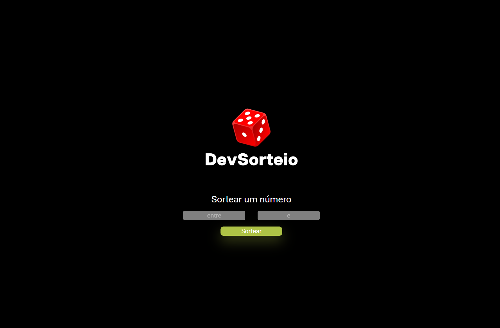
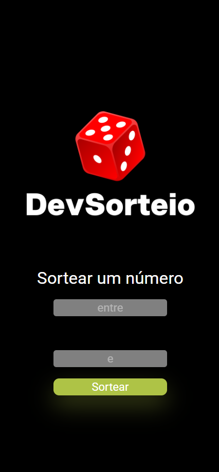

<h1 align="center">DevSorteio</h1>

<p align="center">
  Aplicação web desenvolvida durante meus estudos de HTML, CSS e JavaScript no DevClub.
</p>

<p align="center">
  
</p>

## Sobre o projeto

O **DevSorteio** é uma aplicação web que permite sortear um número aleatório dentro de um intervalo definido pelo usuário.

O projeto foi desenvolvido durante meus estudos no **DevClub**, com o objetivo de praticar a integração entre HTML, CSS e JavaScript, criando uma interface que recebe dados do usuário e executa uma lógica de sorteio.

## Tecnologias

* HTML5
* CSS3
* JavaScript

## O que pratiquei neste projeto

* Estruturação de páginas com HTML
* Estilização com CSS
* Manipulação de elementos do HTML com JavaScript
* Captura de valores através de inputs
* Criação de funções
* Estruturas condicionais com `if` e `else`
* Validação de dados
* Uso de `Math.random()`
* Uso de `Math.floor()` e `Math.ceil()`
* Geração de números aleatórios
* Integração entre HTML, CSS e JavaScript

## Funcionalidades

* Definição de um número mínimo
* Definição de um número máximo
* Geração de um número aleatório dentro do intervalo informado
* Validação para impedir que o valor mínimo seja maior ou igual ao valor máximo
* Exibição do resultado do sorteio

## Preview

### Desktop

<p align="center">
  
</p>

### Resultado do sorteio

<p align="center">
  
</p>

## Como funciona

O usuário informa um valor mínimo e um valor máximo.

O JavaScript captura os valores digitados e utiliza `Math.random()` para gerar um número aleatório dentro do intervalo escolhido.

Caso o número mínimo seja maior ou igual ao número máximo, o sistema exibe uma mensagem de alerta informando que os valores são inválidos.

## Estrutura do projeto

```text id="bg3m9j"
Projeto-DevSorteio/
│
├── Logo.png
├── captura1.png
├── captura2.png
├── index.html
├── script.js
├── style.css
└── README.md
```

## Como executar

Clone o repositório:

```bash id="pr0x6v"
git clone https://github.com/lemueltimotio/Projeto-DevSorteio.git
```

Depois abra o arquivo `index.html` no navegador.

## Projeto online

O projeto também está publicado utilizando o **GitHub Pages**.

Acesse:

```text id="pm3e7v"
https://lemueltimotio.github.io/DevSorteio/
```

## Autor

Desenvolvido por **Lemuel Juan Dias Timotio** durante meus estudos de desenvolvimento web no DevClub.
